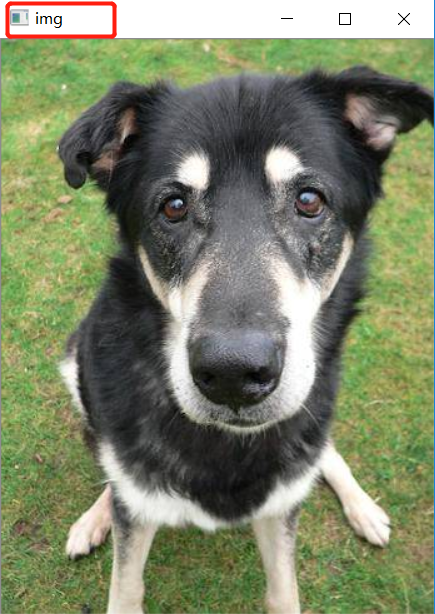

# OpenCV(cv2.imshow)无法显示图像

在Pycharm中运行`cv.imshow()`函数的时候，图形界面闪了一下就消失了。

后来，在Stackoverflow上发现了解决的方法。


**原来，在运行`cv2.imshow`后，需要使用`cv2.waitKey`来保持窗口的显示。**

接下来就介绍下这两个函数，`cv2.imshow`，`cv2.waitKey`。

---

`cv2.imshow('显示窗口名称',图像数组)`

比如我这样写：

```python
img1 = cv2.imread('002.jpg')
cv2.imshow('img', img1)
cv2.waitKey(0)
```

显示图像窗口的标题是这样的：



为了显示图像，官方文档中进行了说明，`imshow`后必须使用`waitKey`

---

`cv2.waitKey(delay)`

`delay`参数表示延迟多少毫秒。默认情况为`0`。当`delay≤0`，可以理解为延迟无穷大毫秒，就是暂停了。