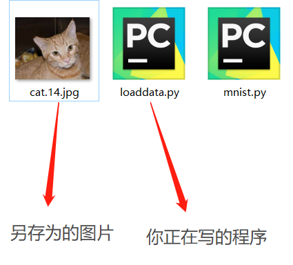

# Pytorch读取，加载图像数据(一)

在学习Pytorch的时候，先学会如何正确创建或者加载数据，至关重要。

有了数据，很多函数，操作的效果就变得很直观。

**本文主要用其他库读取图像文件（学会这个，你就可以在之后的学习中，将一些效果直观化）**

## 零：准备

加载数据前，需要掌握正确的读取路径方法。很多教程中的例子，在讲解的时候，没有提供图片，或者读者不知道修改教程中的读取路径，打击了热情。

**建议：为了保证大家可以跟着教程一步一步练习，教程中会出现示例图片，建议大家右键-另存为图片，将图片保存到 你运行程序的文件夹 中。**

如下图：



## 壹：数据集的准备

任务：我们用不同的方式读取这两张图片（记得右键-另存为图片，保存到程序所在位置，记得文件重命名为你喜欢的方式，我的重命名为`002.jpg`和`003.jpg`


将文件另存为后，同时新建一个python文件，我的效果如下：


接下来，我们就可以在`load_images.py`中，进行相关操作了。

## 贰：用其他库读取图像文件

* **使用`matplotlib`库进行图像的读取**

`matplotlib`中的函数跟Matlab很像。

我们需要使用`matplotlib.pyplot`中的函数：

`imread（文件地址）`：进行读取图像的操作（参数为读取图像文件的路径）

`imshow（数组）`：进行图像的显示操作（显示图像的数组）

`show（）`：显示一个窗口，用于显示图像（很多时候，不显示图像的话，是忘记使用这个函数）

**我们尝试探讨，图像被读取后的数据类型，大小形状**

```python
import matplotlib.pyplot as plt

img = plt.imread('002.jpg')
#图片的高H为460，宽W为346，颜色通道C为3
print(img.shape)
print(img.dtype)
print(type(img))
plt.imshow(img)
plt.show()
```

输出为：

```python
(460, 346, 3)
uint8
<class 'numpy.ndarray'>
```

**结论：`imread`读取的图片为`numpy.ndarry`的数组，数组的大小排列为：高×宽×通道数，数组的数据类型是`uint8`，即每个数据的大小为[0,255]**

如果不想手动进行多图像的读取，需要使用到Python的文件，路径操作等。暂不介绍

手动添加的话，就是用`[array1,array2]`这种形式，将数组进行连接

```python
import matplotlib.pyplot as plt

img1 = plt.imread('002.jpg')
img2 = plt.imread('003.jpg')
img = [img1, img2]
for i in img:
    plt.imshow(i)
    plt.show()
```

---

* **使用`cv2`进行图像的读取**

在`cv2`库中，需要用到的函数有：

`imread（文件地址）`：读取地址处的文件图像

`imshow('窗口名称', 图像数组)`：将图像数组显示出来，但必须结合`waitKey()`使用，否则无法显示图像

`waitKey(延迟时间)`：需要设置延迟时间，当延迟时间≤0时，窗口将会一直延迟，延迟无穷长时间，按下任一按键，可以继续执行下面程序。当延迟时间＞0，即窗口图像会显示对应毫秒后，自动消失。

```python
import cv2
img1 = cv2.imread('002.jpg')
print(img1.shape)
print(img1.dtype)
print(type(img1))
cv2.imshow('img', img1)
cv2.waitKey(0)
```

输出为：

```python
(460, 346, 3)
uint8
<class 'numpy.ndarray'>
```

**结论：imread`读取的图片为`numpy.ndarry`的数组，数组的大小排列为：高×宽×通道数，数组的数据类型是`uint8`，即每个数据的大小为[0,255]**

Matplotlib与cv2对图像的数据格式的处理是相似的，但是也是有区别的：

**对于通道的读取，cv2是按BGR的顺序读入，而matplotlib按RGB的顺序读入**

---

* **使用`PIL`库进行图像处理**

`PIL`全称为`Python Image Library`。是给Python提供图像处理相关的库。

需要使用到的函数：

`open（文件地址）`：打开文件，注意是打开，并没有读取。主要作用是保持检查文件地址，同时保证文件是打开的状态。当对图像处理的时候，会自动加载。

`show()`：使用系统自带的图像查看器，查看图像

```python
from PIL import Image
img1 = Image.open('002.jpg')
# 因为PIL有自己的数据结构，所以没有shape,dtype属性
# print(img1.shape)
# print(img1.dtype)
print(type(img1))
img1.show()
```

输出为：

```python
<class 'PIL.JpegImagePlugin.JpegImageFile'>
```

我们可以使用`numpy.array()`函数，将`PIL`结构的数据转换成`numpy`数组。

 ```python
import matplotlib.pyplot as plt
from PIL import Image
import numpy as np

img1 = Image.open('002.jpg')
img1 = np.array(img1)
print(img1.shape)
print(img1.dtype)
plt.imshow(img1)
plt.show()
 ```

输出：

```python
(460, 346, 3)
uint8
```

可以看到，PIL转换成numpy后，数据类型是uint8的。

---

## 叁：总结

主要介绍了使用`matplotlib`,`cv2`,`PIL`库进行图像文件的读取

* `matplotlib`中的`imread`,`imshow`,`show`函数
* `cv2`中的`imread`,`imshow`,`waitKey`函数
* `PIL`中的`open`,`show`函数