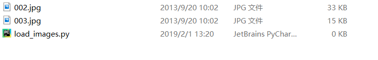

# 加载，读取图像数据

在学习Pytorch的时候，先学会如何正确创建或者加载数据，至关重要。

有了数据，很多函数，操作的效果就变得很直观。

本文主要针对图像，加载图像数据有这些方式：

* 用其他库读取图像文件（学会这个，你就可以在之后的学习中，将一些效果直观化）
* 从PIL中加载图像数据

## 零：准备

加载数据前，需要掌握正确的读取路径方法。很多教程中的例子，在讲解的时候，没有提供图片，或者读者不知道修改教程中的读取路径，打击了热情。

**建议：为了保证大家可以跟着教程一步一步练习，教程中会出现示例图片，建议大家右键-另存为图片，将图片保存到 你运行程序的文件夹 中。**如下图：


## 壹：数据集的准备

任务：我们用不同的方式读取这两张图片（记得右键-另存为图片，保存到程序所在位置，记得文件重命名为你喜欢的方式，我的重命名为`002.jpg`和`003.jpg`


将文件另存为后，同时新建一个python文件，我的效果如下：



接下来，我们就可以在`load_images.py`中，进行相关操作了。

## 贰：用其他库读取图像文件

* **使用`matplotlib`库进行图像的读取**

`matplotlib`中的函数跟Matlab很像。

我们需要使用`matplotlib.pyplot`中的函数：

`imread`：进行读取图像的操作（参数为读取图像文件的路径）

`imshow`：进行图像的显示操作（显示图像的数组）

`show`：显示一个窗口，用于显示图像（很多时候，不显示图像的话，是忘记使用这个函数）

**我们尝试探讨，图像被读取后的数据类型，大小形状**

```python
import matplotlib.pyplot as plt

img = plt.imread('002.jpg')
#图片的高H为460，宽W为346，颜色通道C为3
print(img.shape)
print(img.dtype)
print(type(img))
plt.imshow(img)
plt.show()
```

输出为：

```python
(460, 346, 3)
uint8
<class 'numpy.ndarray'>
```

**结论：`imread`读取的图片为`numpy.ndarry`的数组，数组的大小排列为：高×宽×通道数，数组的数据类型是`uint8`，即每个数据的大小为[0,255]**

如果不想手动进行多图像的读取，需要使用到Python的文件，路径操作等。暂不介绍

手动添加的话，就是用`[array1,array2]`这种形式，将数组进行连接

```python
import matplotlib.pyplot as plt

img1 = plt.imread('002.jpg')
img2 = plt.imread('003.jpg')
img = [img1, img2]
for i in img:
    plt.imshow(i)
    plt.show()
```

* 使用`cv2`进行图像的读取
* 